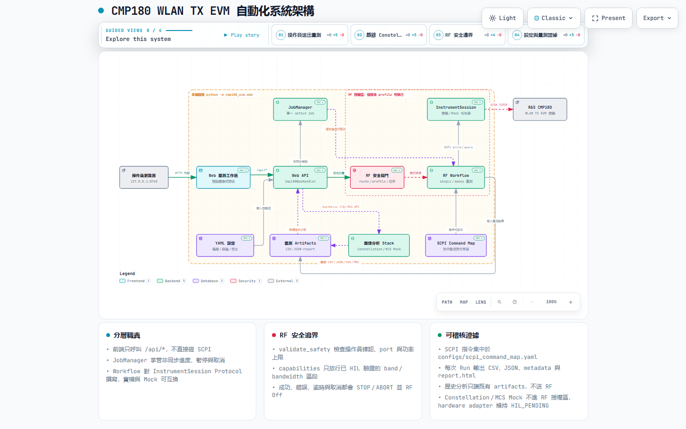

# CMP180 WLAN TX EVM Automation

以 Python 3.11+ 與本機 Web 工作站建立可重現、可稽核的 Rohde & Schwarz CMP180 WLAN TX EVM 自動化流程。專案將設定驗證、RF 安全閘門、量測 lifecycle、Mock、結果分析與 artifacts 分層，避免把軟體完成度誤寫成硬體驗證。

> 目前開發狀態：本輪沒有 CMP180 實機。Constellation 與 MCS Sweep 為 **Software Ready / Mock Verified / HIL Pending**，不包含新 SCPI、RF 或 HIL 證據。

[文件中心](docs/README.md) · [功能完成度 Dashboard](docs/FEATURE_COMPLETION_CHECKLIST.md) · [使用者指南](docs/user-guide.md) · [硬體量測 SOP](docs/hardware-test-sop.md) · [架構圖](docs/diagrams/README.md)

[](docs/diagrams/README.md)

<sub>可互動版本與 SingleShot 生命週期圖見<a href="docs/diagrams/README.md">架構圖</a>。互動圖支援縮放、搜尋、關係追蹤與匯出。</sub>

## 目前能力

| 能力 | Software | Mock | HIL／證據邊界 |
|---|---:|---:|---|
| WLAN SingleShot | ✅ | ✅ | 已有 RF1.1 → RF1.5 與 approved WLAN section 實機證據 |
| Frequency Sweep | ✅ | ✅ | 固定／Web 掃描與 11 個 approved WLAN section 已有證據 |
| Power Sweep | ✅ | ✅ | `INV` fail-fast、有效功率掃描與 V1 acceptance 已有證據 |
| Constellation | ✅ | ✅ | **HIL PENDING**；沒有已驗證 CMP180 acquisition SCPI |
| MCS Sweep | ✅ | ✅ | **HIL PENDING**；沒有已驗證 CMP180 waveform／MCS mapping |
| PA Offline Analysis | ✅ | ✅ | 進階指標仍以 SIMULATED／DERIVED 為主，不能當 DUT 實測 |
| Calibration | ✅ | ✅ | 現行 approved profile 有既有證據；新 fixture／route 必須另行驗證 |
| UDBox | Partial | ❌ | 已有部分 GPRF 軟體骨架，尚無獨立 Mock stack 與核准 DUT HIL |
| 5G NR FR1 | ❌ | ❌ | 架構與 Mock 尚未建立；禁止從其他儀器猜 SCPI |

完整分層、證據與自動計算百分比以[功能完成度 Checklist](docs/FEATURE_COMPLETION_CHECKLIST.md)為準。

## Constellation 工作區

Web 的 `Constellation` 分頁提供 hardware-independent workflow：

- BPSK、QPSK、16／64／256／1024／4096-QAM 單位平均功率理想點。
- Raw I/Q 與 normalized I/Q 切換；invalid 保留為 `null`／`valid=false`，不轉成 0。
- AWGN、phase、quadrature、gain imbalance、DC offset、frequency offset 與 amplitude scale。
- Scatter-only 圖表、ideal reference、equal-axis、zoom、pan、reset、hover 與 outlier 標示。
- RMS／Peak EVM、I/Q mean、I/Q RMS、gain imbalance 與 estimated phase error；來源標為 `SIMULATED · DERIVED`。
- `constellation.csv`、`constellation.json`、`constellation.svg`、`constellation.png`、`constellation_metadata.json`。

硬體 adapter 目前只定義介面，`acquire()` 會明確拒絕執行。Repository 尚無已驗證的 CMP180 Constellation query 與回傳格式，因此沒有把任何猜測命令放入 SCPI registry。

## MCS Sweep 工作區

Web 的 `MCS Sweep` 分頁提供 EHT MCS 0–13 的 hardware-independent framework：

- 支援逗號分隔、非連續且保留順序的 selected MCS list，例如 `0,3,5,7,9,11`。
- 輸出 modulation、coding rate、EVM、power、frequency error、reliability 與 validity。
- 可切換 EVM vs MCS 與 Power vs MCS；匯出 `mcs_sweep.csv`、`mcs_sweep.json`、SVG、PNG 與 metadata。
- Mock 固定標記 `source=mock`、`simulated=true`、`hil_status=HIL_PENDING`，而且沒有正式 compliance limit。

`CMP180MCSSweepSource.acquire()` 同樣會拒絕執行，直到有官方文件、既有 query evidence 或新實機 discovery 證實 waveform／MCS mapping。

## 快速開始

```powershell
git clone https://github.com/DreamerForJay/CMP180-Automation.git
Set-Location CMP180-Automation
py -3.11 -m venv .venv
.\.venv\Scripts\Activate.ps1
python -m pip install -e ".[dev]"
python -m cmp180_evm.web --demo-only
```

瀏覽器開啟 `http://127.0.0.1:8765`。`--demo-only` 不建立 CMP180 session；Constellation 本身也只使用 synthetic data。

常用的離線檢查：

```powershell
python -m cmp180_evm validate-config configs/instrument.example.yaml
python -m cmp180_evm validate-config configs/wlan_baseline.example.yaml
python scripts/build_feature_checklist.py --check
python -m pytest -m "not hardware"
```

## 實機安全邊界

- 未經明確要求不得 Reset 儀器或 Workspace。
- 預設 query-only；`FETCh` 只讀 stored result，`READ`／`INITiate` 會啟動量測。
- RF On 前必須確認 routing、頻率、頻寬、功率、線材／衰減、DUT 與 analyzer input limit。
- 所有 RF workflow 必須在成功、錯誤、逾時與取消後 Stop／Abort 並 RF Off。
- SCPI 只存在於 command map 與 typed registry；未驗證命令維持 `null` 或 `HIL_PENDING`。
- Mock、synthetic dataset、stored artifact 分析與 UI 預覽都不是新 HIL。

實機操作前必讀[硬體量測 SOP](docs/hardware-test-sop.md)。目前使用者採 Single Permission Model；Authentication／RBAC 不在專案範圍，但 RF safety gate 永遠保留。

## 專案結構

```text
configs/                     YAML 範例、能力與 SCPI command map
docs/                        規格、SOP、證據、checklist 與互動架構圖
scripts/                     驗證、報告與 checklist 產生工具
src/cmp180_evm/constellation Constellation model、Mock、分析與 artifacts
src/cmp180_evm/mcs_sweep/     MCS sweep model、Mock、圖表與 artifacts
src/cmp180_evm/web/static/   正式 Web 前端
src/cmp180_evm/workflow/     SingleShot、sweep、校正與 RF safety workflow
tests/unit/                  CI 使用的 unit／mock／schema／artifact 測試
output/                      本機量測與模擬 artifacts；不當作原始碼提交
```

`static_v2/` 與早期規劃文件僅供封存參考；目前正式前端是 `src/cmp180_evm/web/static/`。需求與安全邊界以 `SPEC.MD` 為準，文件權威順序見 `docs/README.md`。

## 驗證與貢獻

提交前執行：

```powershell
.\scripts\precommit_check.ps1
```

CI 只執行 unit、Mock、config、Ruff 與非阻斷 mypy，不可連接公司 CMP180 網段。新增功能必須同步更新程式碼、測試、相關文件與完成度資料來源；SCPI 變更還必須附官方 CMP180 文件、Command Help、Recorder 或受控實機證據。

本專案採 MIT License。安全問題請依 [SECURITY.md](SECURITY.md) 回報。
