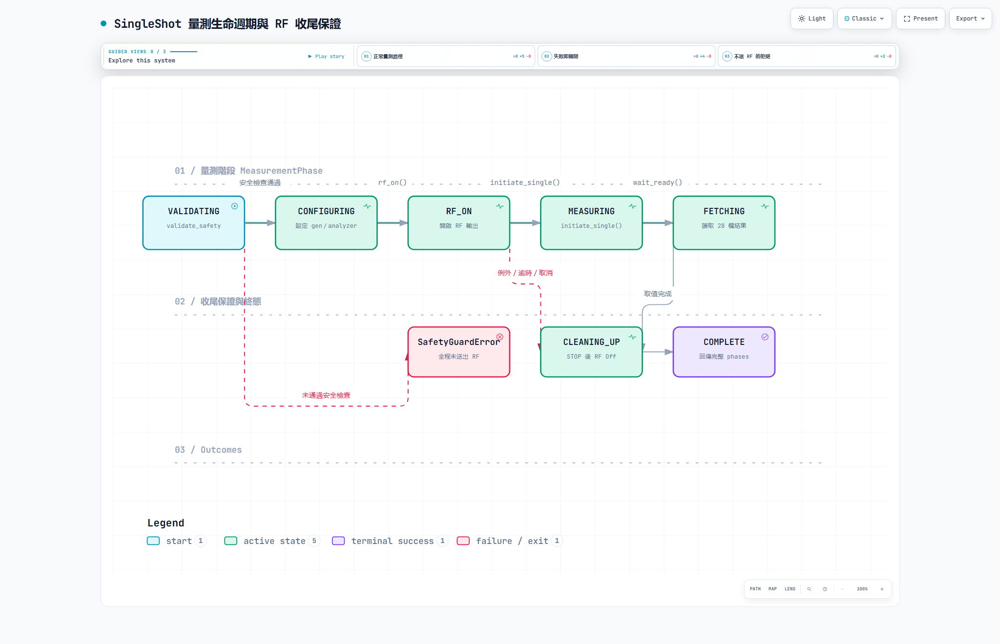
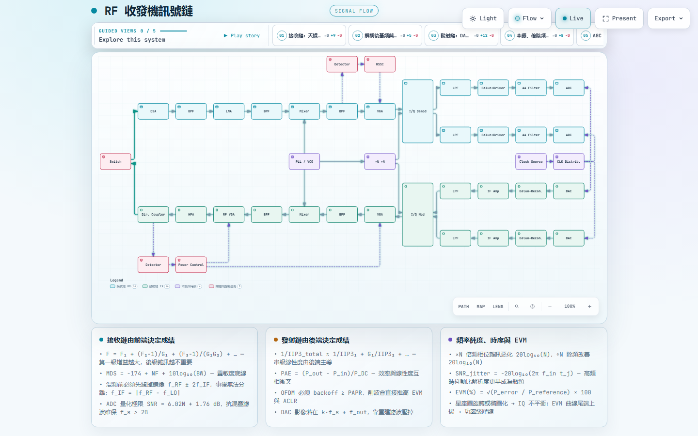

# 架構圖

本資料夾放的是由 [Archify](https://github.com/tt-a1i/archify) 產生的互動式系統圖。每張圖都是
**單一檔案的 HTML**，直接用瀏覽器開啟即可，不需要架站、也沒有外部相依。圖內建深／淺主題、
搜尋、focus、路徑追蹤、導覽章節與 PNG／SVG 匯出。

| 圖 | 內容 | 來源 |
|---|---|---|
| [系統架構](system-architecture.html) | 從操作員瀏覽器到 CMP180 實機的完整分層、RF 授權區，以及不進 RF 路徑的 Constellation／MCS Mock artifact 流向 | [`system-architecture.json`](system-architecture.json) |
| [SingleShot 生命週期](single-measurement-lifecycle.html) | `MeasurementPhase` 七個階段、`finally` 收尾保證與不送 RF 的拒絕路徑 | [`single-measurement-lifecycle.json`](single-measurement-lifecycle.json) |
| [RF 收發機訊號鏈](rf-signal-chain.html) | **通用射頻背景知識**：超外差收發鏈、本振與倍除頻、取樣時脈，以及雜訊、線性度與 EVM 的關係 | [`rf-signal-chain.json`](rf-signal-chain.json) |






> 上面三張是靜態預覽。GitHub 不會直接執行 HTML，線上互動版在
> [系統架構](https://dreamerforjay.github.io/CMP180-Automation/diagrams/system-architecture.html) 與
> [SingleShot 生命週期](https://dreamerforjay.github.io/CMP180-Automation/diagrams/single-measurement-lifecycle.html)；
> 也可以 clone 後直接開啟本資料夾的 `.html`。

### RF 收發機訊號鏈的定位

這張圖**不是 CMP180 的內部架構，也不是本專案的程式結構**，而是給沒有射頻背景的讀者
看的通用超外差收發機訊號鏈：天線、衰減、前選濾波、LNA、混頻、中頻、I/Q 解調、
抗混疊與 ADC，以及對應的發射側與本振、倍除頻、取樣時脈。

三張說明卡整理的是教科書關係式（Friis 串級雜訊、MDS、鏡像頻率、ADC 量化 SNR、
串級 IIP3、PAE、OFDM backoff 與 PAPR、DAC 影像、相位雜訊的 20log₁₀(N)、
jitter 對 SNR 的限制、EVM 定義），用來說明為什麼星座圖會旋轉、EVM 曲線尾端
為什麼會上揚。

因此這張圖的 `meta.repository` 是 `null`：它沒有對應的原始碼行號，也**不包含任何
CMP180 實機量測證據**，不能拿來支撐能力宣稱。若要描述本專案的實際結構，請看上面
兩張圖。

### 這兩張圖對應的程式碼

系統架構圖的既有節點以 `SRC` 徽章指向 revision `254821f` 當下真實存在的檔案與行號，
共 16 筆原始碼引用，由 Archify 對本 repo 驗證通過後才產生。Constellation／MCS 是刻意不綁定
SCPI 的離線 Stack，圖中明確標示 `HIL PENDING`；實作檔案列在下方，避免讓未驗證 acquisition
看起來像不可變硬體證據：

- `src/cmp180_evm/web/server.py` — `Cmp180WebHandler` 與 `/api/*`
- `src/cmp180_evm/web/jobs.py` — `JobManager` 單一 active job、暫停與取消
- `src/cmp180_evm/workflow/single_measurement.py` — `validate_safety` 與 `run_single_measurement`
- `src/cmp180_evm/web/capabilities.py` — 已核准的 band／bandwidth profile
- `src/cmp180_evm/instrument/base.py` — `InstrumentSession` Protocol（實機與 Mock 共用）
- `src/cmp180_evm/scpi/registry.py` — 集中式 SCPI 指令表
- `src/cmp180_evm/results/artifacts.py` — CSV／JSON／metadata／report 輸出
- `src/cmp180_evm/constellation/`、`src/cmp180_evm/mcs_sweep/` — 純軟體 I/Q／EHT model、Mock、分析與 artifact

生命週期圖對應 `workflow/single_measurement.py` 的 `MeasurementPhase` 與 `run_single_measurement`，
另見[SingleShot 狀態機](../single-measurement-state-machine.md)。圖上刻意呈現兩件事：

1. **RF 收尾不可繞過** — RF On 之後的任何例外、逾時或取消都會落入 `finally`，先 `stop_measurement`
   再 `rf_off`；收尾自身的錯誤被收集到 `cleanup_errors`，不會遮蔽原始例外。
2. **拒絕即不送 RF** — 缺少操作員確認、generator 與 analyzer 同 port、或功率超過呼叫端宣告的上限，
   都在 `VALIDATING` 就丟出 `SafetyGuardError`，全程沒有送出任何 RF。

執行閘門只保留儀器物理上做不到的項目；HIL／approved profile 不再參與執行判定，未驗證的頻段、
頻寬與功率組合可以實際量測，但結果不得作為 compliance 宣稱。接線與衰減是否安全由操作員負責。

### 重新產生

圖的權威來源是 `.json`，`.html` 是編譯產物。安裝 Archify skill 後：

```powershell
node bin/archify.mjs validate architecture docs/diagrams/system-architecture.json --quality showcase --repo-root .
node bin/archify.mjs deliver  architecture docs/diagrams/system-architecture.json docs/diagrams/system-architecture.html --quality showcase --repo-root .
node bin/archify.mjs visual-check docs/diagrams/system-architecture.html
```

改動架構後請一併更新 `.json` 並重新 `deliver`，讓圖和程式碼不會失真。若有節點的 `sources`
指向已不存在的檔案，`deliver` 會直接失敗——這是刻意的，用來擋下過期的架構圖。

### 目前狀態

三張圖都通過 Archify 的 9 項 artifact 檢查（showcase profile，0 error、0 warning），
並以真實 Chrome 在 1440×900、1600×1000、1920×1080、2048×1320 四種桌面尺寸完成 containment
與可讀性驗證。生命週期圖的第三條 band 是渲染器固定版面的一部分，本圖未使用。
